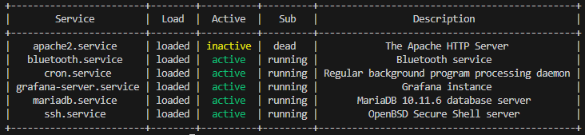

# services_monitor
Monitor of all running services on local server designed to help with development software in real time

## Overview

This project provides a Python script (`app.py`) designed to monitor and display the status of system services on a Linux machine, such as a Raspberry Pi. The script can display the status of all services or a specific list of services defined in an external JSON file. It supports color-coded status indicators and can be used with the `watch` command for continuous monitoring.

## Features

- **Service Status Monitoring**: Fetches and displays the status of all system services.
- **Filter Services**: Option to display only the statuses of services listed in an external JSON file.
- **Color-Coded Status**: Uses color coding to represent the status of services (active, inactive, and others).
- **Command-Line Options**: Supports command-line arguments to choose between displaying all services or only listed services.

## Requirements

- Python 3
- `colorama` library
- `tabulate` library


## Install 

**Install Required Libraries**
```bash
pip install tabulate colorama
```
**Clone script**

```bash
git clone https://github.com/piszczke/services_monitor.git
```

**Modify JSON File**

Edit `services_to_monitor.json` to define the list of services to monitor:
```json
{
    "services": [
        "ssh.service",
        "nginx.service",
        "apache2.service",
        "cron.service"
    ]
}
```

## Usage

for services from the list
```bash
watch -n 10 python3 app.py -l
```

for all services
```bash
watch -n 10 python3 app.py -a
```

## sample output



## Script Details

1. **`load_services_to_monitor` Function**:
    - Loads the list of services to monitor from the `services_to_monitor.json` file.

2. **`get_service_status` Function**:
    - Executes the `systemctl list-units --type=service --all` command to fetch the status of all system services.
    - Parses the output to extract service details.

3. **`filter_services` Function**:
    - Filters the list of services to include only those specified in the `services_to_monitor.json` file.

4. **`colorize_status` Function**:
    - Adds color coding to the service status based on its current state:
        - **Green** for active
        - **Yellow** for inactive
        - **Red** for other states

5. **`print_service_status` Function**:
    - Determines whether to show all services or only those listed in the JSON file.
    - Fetches, filters, and colorizes the service statuses.
    - Displays the service statuses in a table format using `tabulate`.

6. **Command-Line Arguments**:
    - `-l` or `--list`: Show only services from the list.
    - `-a` or `--all`: Show all services.
    - `-g` or `--grafana` : Show JSON output for grafana visualization 

7. **Main Execution Block**:
    - Parses command-line arguments.
    - Calls `print_service_status` with the appropriate option based on the provided arguments.